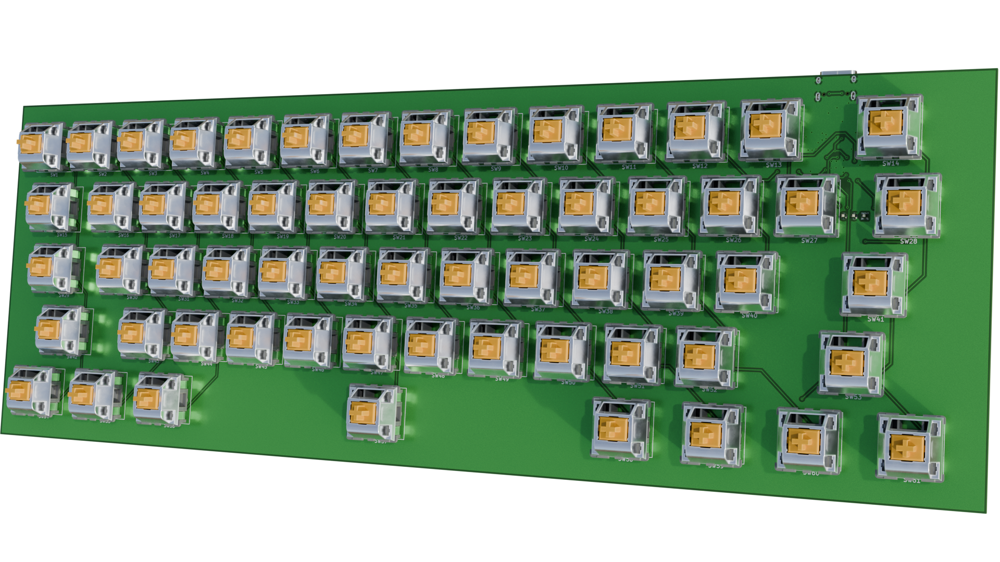
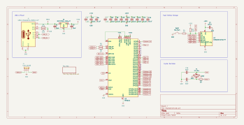
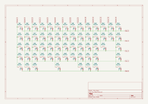
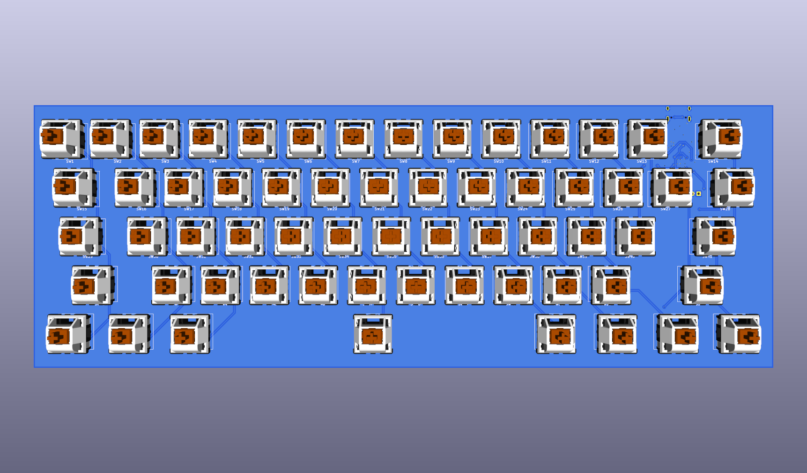
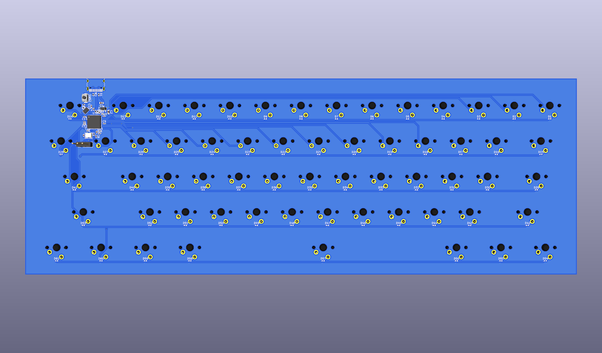

# Full-size keyboard with integrated RP2040 chip
This my second project using RP2040, right after I built the RP2040 devboard!!!

## Components
- RP2040
- 12MHz Crystal (ABM8-272-T3)
- 2MB Flash Storage (W25Q16JVUXIQ)
- Buck-Boost Switching Regulator (RT6154AGQW)
- USB-C (TYPE-C-31-M-12)

## Designs

## Conclusion
I gotta be honest working on this wasn't as easy as I thought, mainly beacuse of new layout for RP2040 and my poor planning (yeah that's my problem).......But anyways I'll order this right after I get my RP2040 devboard that I built previously just in case I made some stupid mistakes lol
