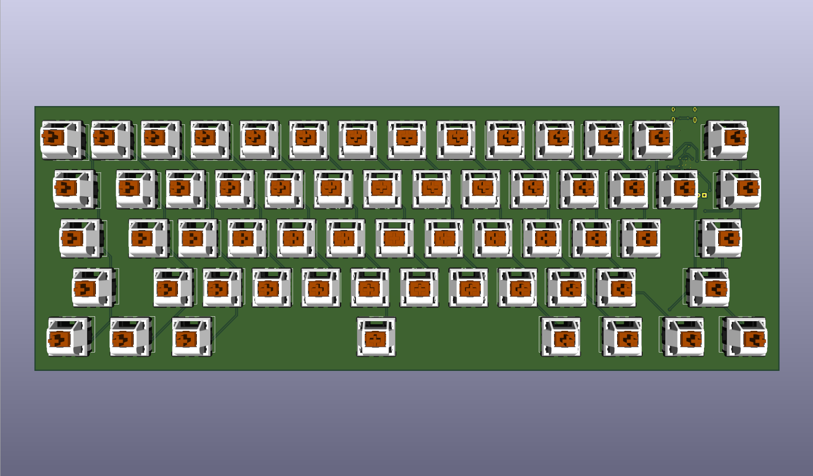
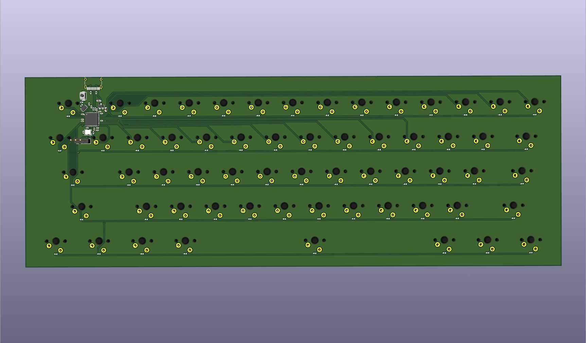

# Full-size keyboard with integrated RP2040 chip
This my second project using RP2040, right after I built the RP2040 devboard!!!

## Components:
- Cherry MX Key Switches
- RP2040 + crystal + flash storage + USB Port

## Images
- 
- 
- 
- 

## Conclusion
I gotta be honest working on this wasn't as easy as I thought, mainly beacuse of new layout for RP2040 and my poor planning (yeah that's my problem).......But anyways I'll order this right after I get my RP2040 devboard that I built previously just in case I made some stupid mistakes lol
